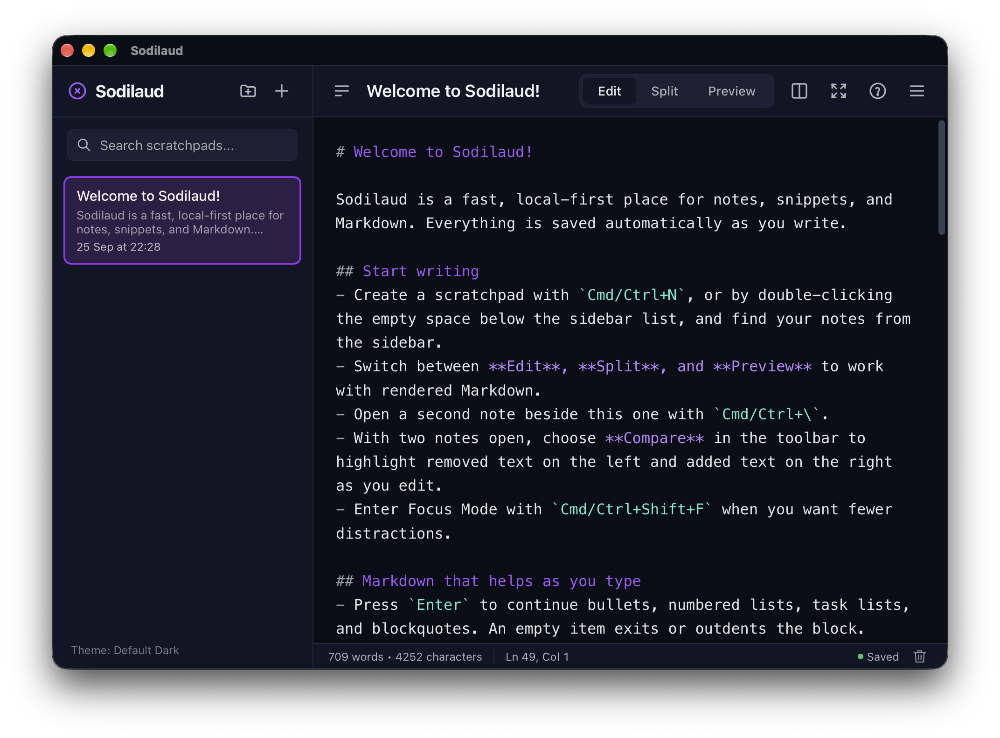

# Sodilaud

[](https://github.com/borgand/sodilaud/actions/workflows/ci.yml)
[](https://github.com/borgand/sodilaud/releases)
[](LICENSE)

Sodilaud is a lightweight, open-source, local-first desktop editor for notes, snippets, and Markdown. It runs on macOS, Windows, and Linux with no account, cloud service, or telemetry. On macOS it also keeps an in-memory clipboard history one hotkey away.

[Visit the Sodilaud website](https://borgand.github.io/sodilaud/) for an OS-aware download and SHA-256 checksums.

<p align="center">
  
</p>

## Install

Download the newest release from the [Sodilaud website](https://borgand.github.io/sodilaud/) or [GitHub Releases](https://github.com/borgand/sodilaud/releases):

- **macOS:** open the `.dmg` and drag Sodilaud to Applications.
- **Windows:** run the `.msi` or `.exe` installer.
- **Linux:** install the `.deb`, or make the `.AppImage` executable and run it.

Packages are not yet production-signed. macOS and Windows may show a security warning, so only install artifacts downloaded from this repository. Back up important workspace files before testing.

See [release notes](RELEASE_NOTES.md) for highlights and compatibility details.

## Clipboard history (macOS)

New in v0.8: press `⌘⇧V` in any app to open your recent text copies, newest first. Pick one with `1`-`9`/`0`, the arrow keys, `j`/`k`, or the mouse to put it back on the clipboard. Press `⌘↵` to paste it into the app you came from, or turn on auto-paste to make every pick paste.

<p align="center">
  
</p>

- **Memory only.** Entries are never written to disk, local storage, workspace files, or logs, never sent to MCP agents, and never sent over the network. Quitting wipes them.
- **Secrets masked.** API tokens, JWTs, private keys, passwords in URLs, and `KEY=value` lines stay hidden until you reveal them with `Space`, `h`, or the eye icon.
- **Expires on its own.** Keep 1 to 50 entries for 1 to 120 minutes. When an entry goes, Sodilaud also clears the system clipboard if it still holds that value.
- **Stays out of the way.** The popup opens over full-screen apps without bringing Sodilaud to the front or changing your `⌘Tab` order.

Clipboard history is off by default. Turn it on in **Sodilaud menu → Clipboard history**. See [clipboard history](docs/clipboard-history.md) for every setting and the full privacy boundary.

## Features

- Clipboard history on macOS: press `⌘⇧V` in any app to pick from your recent copies, with secrets masked, entries kept in memory only, and automatic expiry
- Optional local MCP agent access with five read tools, eight individually enabled write tools, and a live listening indicator
- Multiple scratchpads with automatic saving, titles derived from the first line, and quick creation by double-clicking empty sidebar space
- Edit, synchronized edit/preview, and full Markdown preview layouts
- Optional Markdown editor coloring and language-aware fenced-code highlighting in previews
- Optional, theme-aware source line numbers in either editor pane
- Markdown-aware continuation for lists, task lists, blockquotes, code fences, and tables
- Pair completion, selection wrapping, and smart URL or spreadsheet paste
- Right-click Markdown starter templates for tables, task lists, code blocks, and links
- Two-note side-by-side editing with drag-to-split and live source comparison
- Top-level pinned notes, collapsible sidebar folders with drag-and-drop organization, search, configurable note previews, manual ordering, word counts, and distraction-free Focus Mode
- Find and replace with case-sensitive, exact-match, and regular-expression modes, live highlighting, and results across one or every scratchpad
- Native text-file import and Markdown export
- Copy as Markdown or sanitized rendered HTML
- Optional portable workspace files that reopen automatically
- Recoverable note deletion with persistent trash, Restore actions, and user-confirmed Empty Trash
- Built-in and importable color themes with contrast-aware sidebar and active-note tones
- Persistent editor zoom and adjustable editor line spacing
- A sectioned Sodilaud menu, About panel, keyboard shortcut reference, and Markdown cheatsheet

## Storage and privacy

Sodilaud keeps its state under the app identifier `io.github.borgand.sodilaud`. Development builds (`npm run tauri dev`) use `io.github.borgand.sodilaud.dev` and appear as "Sodilaud Dev", so they never touch the data of an installed release. Workspace files and preferences are kept owner-only (`0600`), and deleted note bodies are overwritten in workspace files.

By default, notes, folders, and trash stay in the desktop webview's local storage. Sodilaud also supports optional portable workspace files for a durable collection of notes, folders, trash, pinned state, and sidebar order. Workspace files use SQLite internally and may have a `.db` or `.sqlite` extension. Notes without a folder remain at the top level of the sidebar; deleting a folder from the sidebar returns its notes there rather than deleting them. Agent folder deletion requires an empty folder.

Local notes and workspace notes are two separate collections, each with its own trash. While a workspace is connected, changes are written to that workspace and the local collection is left exactly as it was, so disconnecting returns the notes and trash you had before. Connecting an empty workspace seeds it with the active notes and folders already available in the app; local trash stays local. A workspace with existing notes, folders, or trash opens its own collection.

Pending workspace changes are flushed before the desktop window closes; if that save fails, Sodilaud cancels the close and reports the error. If a workspace cannot be opened at start-up, Sodilaud reports it and falls back to your local notes, leaving the workspace file untouched.

Sodilaud has no analytics, advertising, accounts, or sync service. Markdown is parsed on-device, preview HTML is sanitized, and remote images are blocked so merely previewing a note does not contact an image host. Links in the preview open in your default browser rather than inside the app; following one is an explicit network action and may contact that destination.

This fork contains no update check and makes no outbound request of any kind: it links no HTTP client, and `npm run check:egress` fails the build if network capability reappears. New versions are published as releases in this repository; download them yourself when you choose to.

The optional [MCP agent access](docs/mcp.md) uses a stdio mode built into the
desktop executable and is off by default. While enabled, it can read the collection open
in Sodilaud, including edits that have not been saved yet. Individually enabled
write functions can create notes and folders, append text, rename notes and
folders, move notes between folders, move notes to recoverable trash, and delete
empty folders. Agents can list trash metadata; restoring and permanently
emptying trash are available only in the UI. Existing-item edits require revision
checks and support safe retries. A connected agent
may send returned note contents to its model provider.

Back up important workspace files like any other local document. Local-only notes remain tied to the app data stored by the operating system and may be lost if that data is cleared.

On macOS, an optional clipboard history feature keeps recent copies in Rust process memory
only. Entries are never written to disk, workspace files, local storage, or sent to
agents; they expire automatically and are wiped on quit. See
[clipboard history](docs/clipboard-history.md) for the settings, privacy guarantees, and a
manual test checklist.

## Agent access (MCP)

Open **Sodilaud menu → Agent access** and turn access **On**. Choose **MCP Configuration** to copy the executable path, `--mcp-stdio` argument, or generic JSON example into a client that supports local stdio MCP servers. Configuration stays available while access is off. Sodilaud must remain open; the accent-colored **MCP listening** indicator appears beside the save status while access is enabled.

Each time access starts, all five read permissions are on and all eight write permissions are off. Use the **Read** and **Write** checkboxes to choose individual functions or select all in a section. Changes apply to connected clients immediately and reset when access is restarted.

| Permission group | Functions |
| --- | --- |
| Read | List folders, list notes, search notes, read note content, list trash metadata |
| Write | Create note, create folder, append to note, rename note, move note, rename folder, delete note to trash, delete empty folder |

Writes to existing items check the current revision before changing anything. Request IDs make retries safe after a timeout or failed save. Agents cannot replace an entire note, read trashed note bodies, restore notes, or empty trash. Access applies to all connected local clients and to the collection currently open in Sodilaud, including unsaved edits.

See the [MCP reference](docs/mcp.md) for client setup, tool arguments, limits, retry behavior, and the privacy boundary.

## Delete and recover notes

Use a note's sidebar delete button or right-click it and choose **Delete Note** to move it to trash. Click the **trash icon at the bottom right** to see deleted notes and choose **Restore**. Restoring preserves the note's content, title, and pin state, returning it to its original folder or the top level if that folder no longer exists.

Right-click the trash icon and choose **Empty Trash…**, then confirm to permanently remove the listed recovery copies. Keyboard users can focus the icon and press `Shift+F10` to open its menu. Trash survives restarts and has no automatic expiry. Only the user can restore notes or empty trash; MCP agents can list its metadata. See [storage and recovery details](docs/mcp.md#deleting-and-recovering-notes) for save-failure behavior.

## Keyboard shortcuts

The app displays `Cmd` on macOS and `Ctrl` on Windows or Linux.

| Shortcut | Action |
| --- | --- |
| `Cmd/Ctrl + N` | Create a scratchpad |
| `⌘⇧V` (macOS, configurable) | Open the clipboard history popup |
| `⌘↵` (macOS, clipboard popup) | Paste the focused entry into the previous app |
| `Cmd/Ctrl + B` | Toggle the sidebar |
| `Cmd/Ctrl + \` | Toggle two-note side-by-side editing |
| `Alt + ↑` / `Alt + ↓` | Move a list branch, or the active sidebar note outside a list |
| `Cmd/Ctrl + F` | Open or close Find |
| `Cmd/Ctrl + H` | Open Find and Replace |
| `Alt + C` | Toggle case-sensitive matching while Find is open |
| `Alt + W` | Toggle exact whole-word matching while Find is open |
| `Alt + R` | Toggle regular-expression mode while Find is open |
| `Enter` / `Shift + Enter` | Select the next or previous match |
| `Enter` | Continue a list or blockquote, close a new code fence, or extend a table |
| `Tab` / `Shift + Tab` | Nest or outdent a list, navigate table cells, or insert plain indentation |
| `Home` | Move to list-item content first, then the beginning of the line |
| `Cmd/Ctrl + +` / `Cmd/Ctrl + -` | Zoom the editor in or out |
| `Cmd/Ctrl + 0` | Reset editor zoom to 100% |
| `Cmd/Ctrl + Shift + F` | Toggle Focus Mode |
| `Cmd/Ctrl + /` or `F1` | Open or close Help and Reference |
| `Tab` / `Shift + Tab` | Switch topics while Help is open |
| `Escape` | Close the active modal or Find bar, or leave Focus Mode |

## Markdown editing

Sodilaud keeps its Markdown assistance lightweight and works directly in the native text editor:

- `Enter` preserves the marker and spacing of bullet lists, advances ordered-list numbering, and creates unchecked task items. An empty item outdents or exits its list.
- `Tab` at the start of a list item nests the complete item and its children; `Shift+Tab` outdents them. Elsewhere, Tab inserts indentation. Fenced code always receives literal indentation.
- Blockquotes continue at the same depth. Starting a fenced code block closes the fence and leaves the cursor between the markers.
- Parentheses, brackets, braces, quotes, and inline backticks pair automatically. Typing an existing closing character advances past it, and Backspace removes an empty pair. Selecting text before typing `*`, `_`, <code>`</code>, or `~` wraps the selection.
- Finishing a table header creates its separator and first row. `Enter` in the final cell or `Tab` past it adds a row; `Enter` or Backspace on an empty generated row exits the table.
- Pasting a URL over selected text makes a Markdown link. Pasting a rectangular tab-separated spreadsheet range makes a Markdown table; ragged or uniformly indented tab-separated text stays literal.
- Right-click in either editor and choose **Insert** for a starter table, task list, fenced code block, inline link, or reference-style link. The first useful placeholder is selected so typing replaces it immediately.

Syntax highlighting is enabled by default. Open **Sodilaud menu → Appearance → Syntax highlighting** to toggle both the editor’s Markdown coloring and language-aware Preview highlighting. Preview code highlighting requires a supported language after the opening fence, such as <code>```javascript</code>; unknown and unlabeled fences remain plain code.

Source line numbers are off by default. Open **Sodilaud menu → Appearance → Line numbers** to show a subtle, theme-aware gutter in both editor panes; the preference is remembered between launches.

Open two notes side by side, then choose **Compare** in the toolbar to highlight source differences without changing either note. Removed text is marked on the left, added text on the right, and related words receive contiguous substring detail. The toolbar reports the total number of changed lines across both notes. Comparison refreshes after a brief pause in typing, showing **Updating comparison…** while pending, and turns off when split view closes.

## Themes

Sodilaud includes Default Dark and Light, Dracula, Catppuccin Mocha, Nord, Tokyo Night, Monokai Pro, One Dark Pro, Solarized Dark and Light, Amber CRT, Green CRT, Pastel Daydream, Macintosh System 6, Mac OS 9 Platinum, Windows Classic, and GitHub Dark.

A custom JSON theme requires `background` and `foreground`. Other colors receive defaults when omitted:

```json
{
  "name": "Amber CRT",
  "background": "#120f08",
  "foreground": "#f6c453",
  "sidebar": "#1b160b",
  "accent": "#ffb000",
  "border": "#4a3814",
  "selection": "#5c4315"
}
```

Simple TOML/key-value theme files using the same names are also accepted. Imported colors are validated before they are stored or rendered. Opaque hex, RGB, HSL, named, and `color(srgb …)` values are measured against the theme's own surfaces so secondary text remains readable; translucent or wider-gamut values are preserved without being flattened into guessed colors.

## Development

### Prerequisites

- Node.js 20 or newer
- Rust 1.98.0 (also declared in `rust-toolchain.toml`)
- The dependencies in the [Tauri prerequisites guide](https://tauri.app/start/prerequisites/)

### Run locally

```bash
git clone https://github.com/borgand/sodilaud.git
cd sodilaud
npm install
npm run tauri -- dev
```

The frontend is served directly from `src/`; there is no framework-specific development server.

### Validate changes

```bash
npm run check
cargo fmt --manifest-path src-tauri/Cargo.toml --check
cargo clippy --manifest-path src-tauri/Cargo.toml --all-targets -- -D warnings
cargo test --manifest-path src-tauri/Cargo.toml
```

### Build locally

```bash
npm run tauri -- build --config src-tauri/tauri.release.conf.json
```

Without `--config`, the build uses the development identity (`Sodilaud Dev`).

Bundles and installers are written beneath `src-tauri/target/release/bundle/`.

## Releases

The **CI** workflow validates every push to `main` and every pull request. The manually triggered **Release** workflow validates the project, builds macOS, Windows, and Linux packages with `src-tauri/tauri.release.conf.json`, and attaches them to a draft release tagged `vX.Y.Z`.

Before triggering a release, update the version in `package.json`, `src-tauri/Cargo.toml`, `src-tauri/tauri.conf.json`, both lockfiles, and the About panel in `src/index.html`. Update `RELEASE_NOTES.md`, the README, MCP reference, welcome note, and in-app Help for the final feature set. The validation command checks version consistency, and the workflow refuses to overwrite an existing release tag. Review the generated draft and its assets before publishing it. The website's download manifest is generated from published GitHub releases; do not point it at unbuilt packages.

Production distribution will also require platform signing and, on macOS, notarization credentials configured as repository secrets.

## Architecture

| Area | Implementation |
| --- | --- |
| Desktop runtime | Tauri v2 and Rust |
| Frontend | Vanilla HTML, CSS, and JavaScript |
| Markdown | Bundled Marked parser with an allowlist sanitizer |
| Syntax highlighting | Bundled Highlight.js for explicitly labeled fenced code blocks |
| Note comparison | Bundled jsdiff with line and word-level source comparison |
| External links | `tauri-plugin-opener`, scoped to `http`, `https`, and `mailto` |
| Local persistence | Desktop webview local storage |
| Workspace persistence | Bundled SQLite through `rusqlite` |
| Agent integration | Toggleable stdio MCP access in the desktop binary through the official Rust MCP SDK |
| Native preferences | JSON in the platform app configuration directory |
| Themes | CSS custom properties with JSON and TOML/key-value import |

## Contributing and security

See [CONTRIBUTING.md](CONTRIBUTING.md) for the development workflow. Please report suspected vulnerabilities privately using the process in [SECURITY.md](SECURITY.md).

## License

Sodilaud is free software licensed under [GPL-3.0-or-later](LICENSE). It is a hard fork of [Scratchpad](https://github.com/crims0n/scratchpad) by crims0n, used under the same license. The bundled Marked parser is provided under the MIT License; Highlight.js and jsdiff are provided under the BSD 3-Clause License. See [THIRD_PARTY_NOTICES.md](THIRD_PARTY_NOTICES.md).
