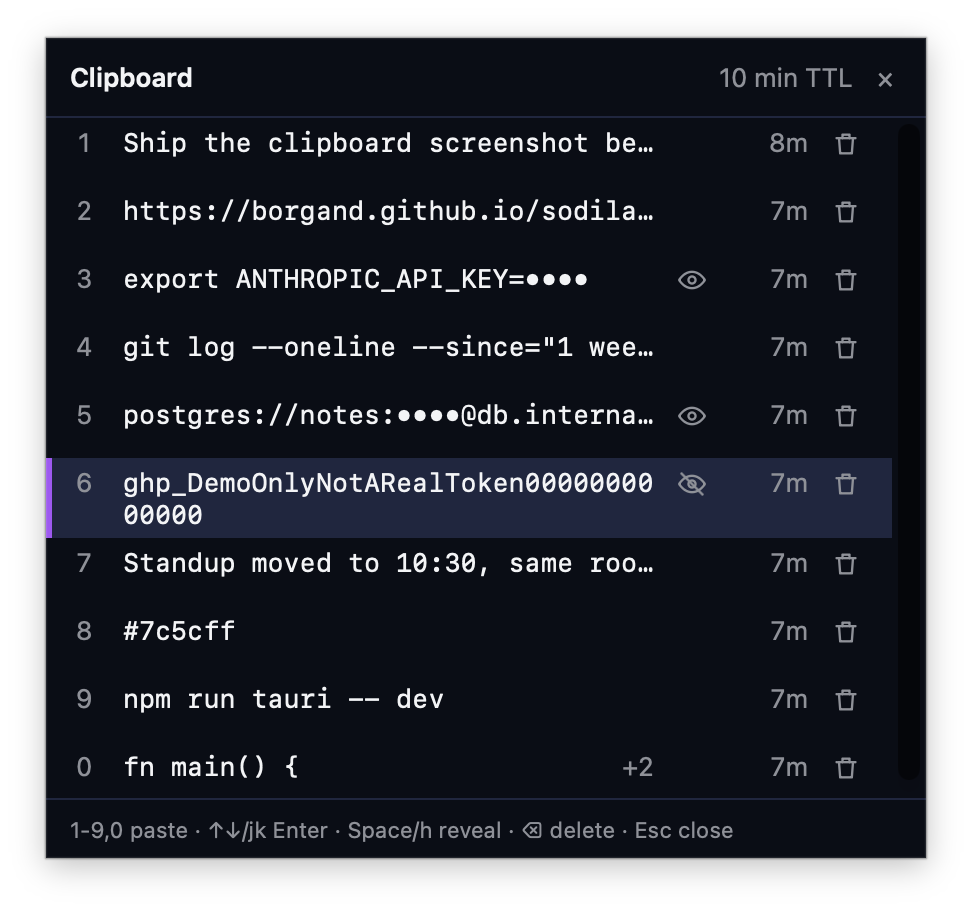

# Clipboard history (macOS)

  

Clipboard history is an optional, macOS-only feature that keeps the last few things you
copied so you can pick one back up without re-copying it from its source. It is off by
default. On Windows and Linux it is not wired up: the platform-independent core and the
command stubs compile there, but the settings section is hidden and every clipboard command
returns `Unsupported`.

When enabled, every text copy from any app is captured automatically, including copies
from password managers. Press the hotkey (`⌘⇧V` by default) to open a small popup listing
your recent copies, newest first. Pick one with `1`-`9`/`0`, or `↑`/`↓` (or `j`/`k`) and
`Enter`, to put it back on the system clipboard; press `⌘V` yourself to paste it, or turn on
auto-paste in settings to have Sodilaud post `⌘V` for you. `Space` or `h` reveals a masked
entry at the focused row. The popup is a floating panel that takes
keyboard input without activating Sodilaud, so the app you were using stays frontmost,
the popup also appears over full-screen apps, and the `⌘⇥` order does not change. Drag the
popup by its header to look behind it; it opens at its usual spot again next time.
Auto-paste only fires if the app that was frontmost when you pressed the hotkey is still
frontmost about 120 ms after the popup closes, and it never pastes into Sodilaud itself;
if either check fails, the value stays on the clipboard for a manual paste. Entries expire a
fixed time after they were copied, values that look like secrets are masked in the popup,
and the history lives only in memory: nothing is written to disk, to the workspace
database, or sent anywhere.

## Settings

| Setting | Range | Default |
|---|---|---|
| Enable clipboard history | on/off | off |
| History size | 1-50 | 10 |
| Expire after | 1-120 min | 10 |
| Hotkey | key capture + Reset | Cmd+Shift+V |
| Paste automatically after picking | on/off | off |

Open the **Sodilaud menu** and choose **Clipboard settings** in its Clipboard history
section to change these. The tray's **Clipboard History…** item opens the popup, not the
settings. A rejected hotkey shows an inline error. If another hotkey was registered, it
stays active; if none was, the error says that no hotkey is active, and Sodilaud keeps the
requested hotkey so the next settings change retries it. Turning on auto-paste checks
Accessibility; without it, Sodilaud shows a "Grant Accessibility in System Settings" row
with an Open button and falls back to copy-only until you grant it and restart Sodilaud.
Lowering the history size evicts the oldest entries immediately. Changing the expiry time
applies to existing entries from their original copy time, not from the moment you changed
the setting. The settings dialog closes with Escape, a click on its backdrop, or its close
button.

## Privacy guarantees

- Clipboard values live only in Rust process memory (a `Zeroizing<String>` per entry) and
  are never written to disk, localStorage, the workspace database, logs, the MCP snapshot,
  or the network.
- History is wiped, and the system clipboard cleared if it still holds the value, on: entry
  expiry, entry deletion, lowering the history size below an entry's slot, disabling the
  feature, and quitting Sodilaud.
- Quitting from the tray or with `⌘Q` in the main window first wipes the clipboard history
  and clears the system clipboard if it still holds a picked entry. Sodilaud then flushes
  any pending note saves and exits; a failed flush cancels the quit and shows an error, the
  same as today's close behavior, but the history is already gone and capture stays
  stopped until you change a clipboard setting or restart Sodilaud. If the main window has
  not registered its quit handler, Sodilaud exits directly without the flush, as `⌘Q` did
  before this feature. System-initiated exits (logout, the Dock's Quit, or `terminate:`)
  skip the flush, as before this feature, but still wipe the history on the way out.
- Every write Sodilaud makes to the system clipboard is marked current-host-only and
  concealed/transient, and carries a private marker type so Sodilaud's own writes are never
  re-captured into history. This keeps picked values out of Universal Clipboard and out of
  third-party clipboard managers that respect those markers.
- The main Sodilaud window can only configure the feature (`clip_set_config`); it cannot
  list, reveal, select, or delete entries. Only the popup window holds the `clip_list`,
  `clip_reveal`, `clip_select`, `clip_delete`, `clip_close`, `clip_shown`, `clip_hidden`,
  and `clip_start_drag` permissions, and it has no general window permissions: `clip_close`
  hides only the popup itself, and `clip_start_drag` moves only the popup itself.
- The popup window is created once, when you enable the feature, and reused. Every time it
  hides (Esc, a pick, a click elsewhere, the hotkey, the close button, or disabling), it
  turns transparent at once, and its page forgets the list and every revealed value and
  stops refreshing. The window leaves the screen once the page reports that the emptied
  page has been painted, or after 300 ms if it does not. An open becomes visible only after
  the page reports that the new list has been painted, so each open starts fully masked
  and never shows the previous open's rows. While the popup is hidden, Rust refuses to
  list, reveal, pick, or delete entries. The window is destroyed when you disable the
  feature or quit.
- The popup window is content-protected, so screen sharing and screenshots should show it
  blank. This is best effort: some capture paths may ignore it. To take a screenshot for
  documentation, run a local build with the `.content_protected(true)` line in
  `src-tauri/src/clipboard/popup.rs` commented out, copy only made-up values, and do not
  commit the change.
- Clipboard history is never reachable from MCP. The MCP snapshot sent to agents never
  includes it, by capability boundary as well as by code: the clipboard module is not
  referenced from the MCP server.

## Known residue

Some copies cannot be wiped because they are held by frameworks Sodilaud does not control:

- The `NSString` objects AppKit creates when Sodilaud reads the pasteboard, and when it
  writes a picked entry to the pasteboard or compares the pasteboard's contents before
  clearing it.
- Tauri IPC buffers for `clip_list` and `clip_reveal` responses.
- The heap of the popup webview's WebContent process. The page drops its references on
  every hide, but freed memory there is not zeroed, so list previews and revealed values
  can stay in that process's memory, which lives from enable to disable or quit, until the
  memory is reused.
- The last frame the popup showed before a hide, if its page does not report the emptied
  page painted within 300 ms. That frame, which can include a revealed value, then stays
  in the window server's and WebKit's layer memory after the popup leaves the screen. It
  is never shown again: the next open stays transparent until its own list has painted.
- Any app you have granted Accessibility permission can read the popup's visible text
  through the macOS Accessibility (AX) API while the popup is open.

## Known limitations

- The popup's height is fixed at the moment it opens; if the list grows while it is open,
  the list scrolls instead of the window resizing.
- Pressing the hotkey immediately after switching Spaces can make the popup close again at
  once; the next press works. The likely cause is macOS handing keyboard focus to the new
  Space's app while the popup appears, which the popup treats as a click elsewhere.
  Reclaiming focus in that window was left out on purpose, because it could steal focus
  from a deliberate switch.

## Manual macOS checklist

Automated tests cover the store, masking, and the guard tests around the MCP and capability
boundaries. The following needs a human on a real Mac and was not run during
implementation:

- [ ] Enable, copy three values in another app, and press `⌘⇧V`. The popup appears centered
  at the top third of the focused screen. Repeat on a second monitor.
- [ ] Press `1`-`3` and `Enter` to pick, then paste with `⌘V`. Focus returns to the previous
  app.
- [ ] Re-copy an existing value. It moves to the top, and its time left is unchanged.
- [ ] Set the TTL to 1 min, copy a value, and wait. The row disappears, and `pbpaste` prints
  nothing.
- [ ] Copy `ghp_…`, a JWT, `postgres://u:p@h`, and `API_KEY=x`. Each is masked; Space and the
  eye icon reveal it, and reopening the popup masks it again.
- [ ] Trash a row. `pbpaste` prints nothing if that value was on the clipboard.
- [ ] Lower the size to 1. The oldest entries go.
- [ ] Disable the feature. The hotkey does nothing and the history is gone after
  re-enabling.
- [ ] Auto-paste without Accessibility falls back to copy-only and shows the grant row. With
  Accessibility granted and Sodilaud restarted, a pick pastes immediately.
- [ ] The tray shows Show, Clipboard History…, Clear, and Quit. Close the window: the Dock
  icon is gone and the tray icon stays. Quit exits. Pressing `⌘Q` while the popup is open
  closes only the popup.
- [ ] Set the TTL to 1 min, copy a value, sleep the Mac for 2 min, and wake it. The entry is
  gone within a second.
- [ ] Picked values do not appear on an iPhone through Universal Clipboard, and a
  third-party clipboard manager ignores them.
- [ ] Canary check: copy `sodilaud-canary-<random>`, use the popup, then quit. Then run:
  `grep -r "sodilaud-canary" ~/Library/Application\ Support/io.github.borgand.sodilaud ~/Library/WebKit ~/Library/Caches 2>/dev/null`
  and search your workspace `.db` file. Expected: no matches.
- [ ] On Windows or Linux (if available), the settings section is absent and closing the
  window quits.
- [ ] Share the screen or take a screenshot while the popup is open. The popup should be
  blank or missing in the capture.
- [ ] On macOS versions with a system clipboard history (Spotlight), pick an entry in the
  popup and check whether the value appears in the system clipboard history. If it does,
  turn the system clipboard history off when you use Sodilaud with secrets.

The following were deferred during implementation for lack of a human tester and should be
checked before release, in addition to the items above:

- [ ] Popup position is correct on both a single monitor and a two-monitor setup.
- [ ] Focus returns to the previous app after picking an entry and after pressing Esc.
- [ ] `⌘⇧V` toggles the popup open and closed.
- [ ] Auto-paste works end to end with Accessibility granted, including after restarting
  Sodilaud so the grant takes effect.
- [ ] Every tray menu item (Show, Clipboard History…, Clear, Quit) does what its label says.
- [ ] Hiding and showing the app through the Dock and through the tray both work.
- [ ] Quit from the tray and `⌘Q` in the main window both wipe, flush, and exit.
- [ ] Pressing `⌘Q` while the popup is open closes only the popup, not the app.
- [ ] Open the popup over full-screen Ghostty and over full-screen Safari. The popup is
  visible on the full-screen Space and takes typing (arrows, digits, Esc) at once.
- [ ] With the main Sodilaud window open on the same Space as another app, open the popup
  and close it with the hotkey, a pick, and Esc. The main window never flashes in front.
- [ ] Use `⌘⇥` right after using the popup. The app you were in is still the most recent
  app; Sodilaud has not moved to the front of the list.
- [ ] With the popup open, click another app's window. The popup closes and the app you
  clicked stays in front.
- [ ] Open the popup several times, including the first time after enabling and after
  launching with the feature on. It never shows a white rectangle, an empty list, or the
  previous open's rows before the current list appears.
- [ ] With the main Sodilaud window open on another app's Space, open the popup there. The
  main window does not come forward with the popup and does not hide with it.
- [ ] Open and close the popup a few times, then press `⌘⇥`. The order is the same as before
  the popup opened; Sodilaud has not moved to the front.
- [ ] Reveal a masked entry, close the popup with each of Esc, a click elsewhere, the hotkey,
  and the close button, and reopen it. The entry is masked again each time.
- [ ] Drag the popup by its header ("Clipboard" or the TTL). It moves and keeps keyboard
  focus. Dragging from the close button does not move it, and the header text is not
  selectable. Close and reopen: the popup is back at its fixed spot.
